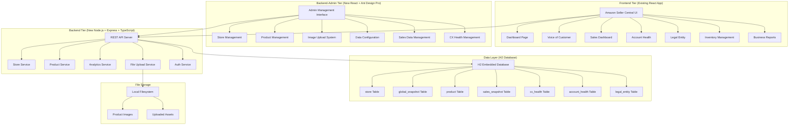

# Design Document

## Overview

This design document outlines the comprehensive three-tier architecture for restructuring and expanding the existing Amazon Seller Central clone project. The system reorganizes the current React frontend into a `frontend/` folder, creates a new Node.js + Express + TypeScript backend in a `backend/` folder, and builds an administrative management interface in a `backend-admin/` folder.

The design emphasizes preserving the existing pixel-perfect UI while transitioning from mock data to real API integration. The architecture ensures clear separation of concerns, scalable data persistence with H2 database, and maintainable code structure across all three application tiers. The approach prioritizes backend implementation and admin interface creation before frontend optimization.

## Architecture

### System Architecture Overview



### Technology Stack

**Frontend Application (Existing - Move to frontend/ folder)**
- React 18 with TypeScript (existing codebase)
- Tailwind CSS + custom Amazon styling (existing)
- Zustand for state management (existing)
- React Router DOM (existing)
- Axios for API integration (replace mock data)

**Backend-Admin Application (New - backend-admin/ folder)**
- React 18 with TypeScript for consistency
- Ant Design Pro for professional admin components
- React Hook Form + Ant Design forms for data management
- File upload components with drag-and-drop functionality
- Real-time preview capabilities for data changes

**Backend Application (New - backend/ folder)**
- Node.js + Express + TypeScript for robust API server
- H2 Database with better-sqlite3 or node-h2 driver
- Multer for file upload handling
- Joi or Zod for request validation
- Winston for logging
- CORS middleware for cross-origin requests

**Database Schema (H2 Embedded)**
- Embedded H2 database for zero-configuration setup
- JPA entities with proper relationships and constraints
- Database initialization scripts for sample data
- File-based persistence for data durability

### Project Structure Reorganization

```
project-root/
├── frontend/                    # Existing React app (moved here)
│   ├── src/
│   │   ├── components/         # Existing UI components
│   │   ├── features/           # Existing feature pages
│   │   │   ├── Dashboard.tsx   # Main dashboard
│   │   │   ├── BusinessReports.tsx # Business reports
│   │   │   ├── Inventory.tsx   # Inventory management
│   │   │   └── AuthPages.tsx   # Authentication flows
│   │   ├── layouts/            # Existing layout components
│   │   ├── hooks/              # Existing custom hooks
│   │   ├── services/           # API integration services (updated)
│   │   ├── utils/              # Existing utility functions
│   │   ├── store.ts            # Existing Zustand store
│   │   ├── types.ts            # Existing TypeScript definitions
│   │   └── i18n.ts             # Existing internationalization
│   ├── public/                 # Existing static assets
│   └── package.json            # Existing frontend dependencies
├── backend-admin/              # New Admin Interface
│   ├── src/
│   │   ├── components/         # Admin-specific components
│   │   ├── pages/              # Admin management pages
│   │   │   ├── StoreManagement/ # Store info editing
│   │   │   ├── ProductManagement/ # Product CRUD operations
│   │   │   ├── ImageManagement/ # Image upload and management
│   │   │   ├── SalesDataManagement/ # Sales metrics configuration
│   │   │   └── CXHealthManagement/ # Customer experience data
│   │   ├── services/           # Admin API services
│   │   ├── utils/              # Admin utilities
│   │   └── types/              # Admin-specific types
│   └── package.json            # Admin dependencies
└── backend/                    # New Node.js API Server
    ├── src/
    │   ├── controllers/        # Express route controllers
    │   ├── services/           # Business logic services
    │   ├── models/             # Database models/schemas
    │   ├── middleware/         # Express middleware
    │   ├── routes/             # API route definitions
    │   ├── utils/              # Backend utilities
    │   ├── config/             # Configuration files
    │   └── database/           # Database setup and migrations
    ├── uploads/                # Uploaded images storage
    ├── package.json            # Backend dependencies
    └── .env                    # Environment configuration
```

## Components and Interfaces

### Core UI Components

**Layout Components**
- `MainLayout`: Primary application shell with navigation
- `WithSidebarLayout`: Layout with contextual sidebar navigation
- `DashboardLayout`: Specialized layout for dashboard content

**Data Display Components**
- `GlobalSnapshot`: Six-column metrics display component
- `ProductPerformanceTable`: Sortable, paginated product data table
- `BusinessReportsChart`: Interactive charts using Recharts
- `AccountHealthIndicator`: Status display with color-coded health metrics

**Interactive Components**
- `ActionCard`: Left-side cards for to-do items and communications
- `MarketplaceSwitcher`: Dropdown for marketplace selection
- `LanguageSwitcher`: Toggle for language preferences
- `DataExportButton`: Export functionality for reports

**Form Components**
- `SearchInput`: Enhanced search with filtering capabilities
- `FilterDropdown`: Multi-select filtering interface
- `DateRangePicker`: Date selection for report generation
- `FileUploadZone`: Drag-and-drop file upload interface

### Component Interface Specifications

```typescript
// Global Snapshot Component
interface GlobalSnapshotProps {
  data: SnapshotData;
  marketplace: Marketplace;
  isLoading?: boolean;
  onRefresh?: () => void;
}

interface SnapshotData {
  sales: MetricValue;
  orders: MetricValue;
  messages: MetricValue;
  featuredOffers: MetricValue;
  feedback: MetricValue;
  payments: MetricValue;
}

interface MetricValue {
  current: number;
  previous: number;
  change: number;
  currency?: string;
  format: 'currency' | 'number' | 'percentage';
}

// Product Performance Table Component
interface ProductPerformanceTableProps {
  products: Product[];
  onSort: (column: string, direction: 'asc' | 'desc') => void;
  onFilter: (filters: ProductFilters) => void;
  pagination: PaginationState;
  onPageChange: (page: number) => void;
}

interface Product {
  id: string;
  image: string;
  name: string;
  sku: string;
  asin: string;
  status: ProductStatus;
  sales: number;
  inventory: number;
  price: number;
  lastUpdated: Date;
}

// Action Card Component
interface ActionCardProps {
  title: string;
  items: ActionItem[];
  type: 'todo' | 'communication' | 'notification';
  onItemClick?: (item: ActionItem) => void;
}

interface ActionItem {
  id: string;
  text: string;
  priority: 'high' | 'medium' | 'low';
  count?: number;
  isNew?: boolean;
}
```

### API Interface Specifications

```typescript
// Product API Endpoints
interface ProductAPI {
  getProducts(filters?: ProductFilters): Promise<ProductResponse>;
  getProduct(id: string): Promise<Product>;
  updateProduct(id: string, data: Partial<Product>): Promise<Product>;
  uploadProductImage(id: string, file: File): Promise<string>;
}

// Analytics API Endpoints
interface AnalyticsAPI {
  getDashboardData(marketplace: Marketplace): Promise<DashboardData>;
  getBusinessReports(dateRange: DateRange): Promise<ReportData>;
  getAccountHealth(): Promise<AccountHealthData>;
}

// Admin API Endpoints
interface AdminAPI {
  uploadProducts(file: File): Promise<UploadResult>;
  updateProductData(products: Product[]): Promise<UpdateResult>;
  manageImages(action: 'upload' | 'delete', data: any): Promise<ImageResult>;
}
```

## Data Models

### Core Data Structures

```typescript
// User Session and Preferences
interface UserSession {
  email: string;
  isLoggedIn: boolean;
  marketplace: Marketplace;
  language: Language;
  preferences: UserPreferences;
}

interface UserPreferences {
  theme: 'light' | 'dark';
  currency: string;
  dateFormat: string;
  timezone: string;
  notifications: NotificationSettings;
}

// Dashboard Data Model
interface DashboardData {
  welcomeBanner: WelcomeBanner;
  globalSnapshot: SnapshotData;
  productPerformance: Product[];
  actionItems: ActionItem[];
  recentActivity: ActivityItem[];
}

interface WelcomeBanner {
  accountHealth: 'excellent' | 'good' | 'fair' | 'poor';
  healthScore: number;
  criticalIssues: number;
  recommendations: string[];
}

// Business Reports Data Model
interface ReportData {
  salesDashboard: SalesDashboard;
  salesSnapshot: SalesSnapshot;
  performanceInsights: PerformanceInsight[];
  chartData: ChartDataPoint[];
}

interface SalesDashboard {
  totalSales: number;
  totalOrders: number;
  averageOrderValue: number;
  conversionRate: number;
  trends: TrendData[];
}

// Account Health Data Model
interface AccountHealthData {
  overallStatus: HealthStatus;
  performanceMetrics: PerformanceMetric[];
  policyCompliance: ComplianceStatus[];
  notifications: HealthNotification[];
}

interface PerformanceMetric {
  name: string;
  value: number;
  threshold: number;
  status: 'good' | 'warning' | 'critical';
  trend: 'improving' | 'stable' | 'declining';
}
```

### Data Validation Schemas

```typescript
// Zod schemas for runtime validation
const ProductSchema = z.object({
  id: z.string().min(1),
  name: z.string().min(1).max(200),
  sku: z.string().min(1).max(50),
  asin: z.string().regex(/^[A-Z0-9]{10}$/),
  price: z.number().positive(),
  inventory: z.number().nonnegative(),
  status: z.enum(['active', 'inactive', 'out_of_stock']),
  image: z.string().url().optional(),
});

const DashboardDataSchema = z.object({
  globalSnapshot: z.object({
    sales: MetricValueSchema,
    orders: MetricValueSchema,
    messages: MetricValueSchema,
    featuredOffers: MetricValueSchema,
    feedback: MetricValueSchema,
    payments: MetricValueSchema,
  }),
  productPerformance: z.array(ProductSchema),
  actionItems: z.array(ActionItemSchema),
});
```

Now I need to use the prework tool to analyze the acceptance criteria before writing the Correctness Properties section:

<function_calls>
<invoke name="prework">
<parameter name="featureName">amazon-seller-central-pixel-perfect-clone