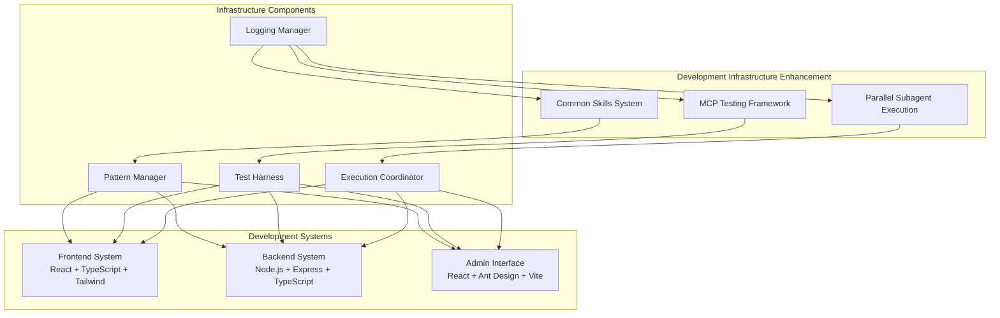
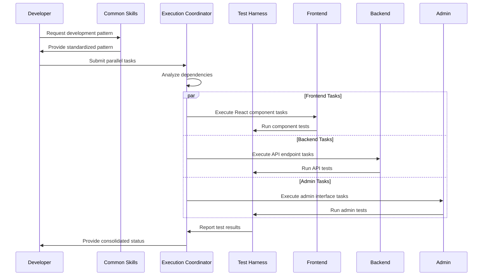

# Design Document: Development Infrastructure Enhancement

## Overview

The Development Infrastructure Enhancement system provides a comprehensive framework for managing development workflows across a multi-tier Amazon Seller Central clone architecture. The system establishes three core pillars: Common Skills for reusable development patterns, MCP Testing Framework for comprehensive tool validation, and Parallel Subagent Execution for coordinated task management.

The architecture supports three distinct development systems:
- **Frontend**: React 18 + TypeScript + Tailwind + Zustand
- **Backend**: Node.js + Express + TypeScript + JSON storage  
- **Admin Interface**: React + Ant Design + TypeScript + Vite

## Architecture

### System Architecture Diagram



### Component Interaction Flow



## Components and Interfaces

### Common Skills System

The Common Skills System provides standardized development patterns and utilities across all three development systems.

#### Pattern Manager Interface

```typescript
interface PatternManager {
  // React Component Patterns
  getReactComponentPattern(type: ComponentType): ComponentPattern;
  getHookPattern(hookType: HookType): HookPattern;
  getStateManagementPattern(stateType: StateType): StatePattern;
  
  // Backend Patterns
  getExpressRoutePattern(routeType: RouteType): RoutePattern;
  getMiddlewarePattern(middlewareType: MiddlewareType): MiddlewarePattern;
  getValidationPattern(validationType: ValidationType): ValidationPattern;
  
  // Common Patterns
  getErrorHandlingPattern(system: SystemType): ErrorPattern;
  getTestingPattern(testType: TestType): TestPattern;
  getConfigurationPattern(configType: ConfigType): ConfigPattern;
}

interface ComponentPattern {
  template: string;
  imports: ImportStatement[];
  typeDefinitions: TypeDefinition[];
  stylePatterns: StylePattern[];
  testTemplate: string;
}

interface RoutePattern {
  template: string;
  middleware: MiddlewareConfig[];
  validation: ValidationSchema;
  errorHandling: ErrorHandlerConfig;
  testTemplate: string;
}
```

#### Standardized Patterns

**React Component Pattern:**
```typescript
// Component Template Structure
interface ReactComponentTemplate {
  // 1. Type definitions
  props: PropsInterface;
  state?: StateInterface;
  
  // 2. Component implementation
  hooks: HookUsage[];
  eventHandlers: EventHandler[];
  renderLogic: JSXStructure;
  
  // 3. Styling approach
  tailwindClasses: TailwindConfig;
  amazonTheme: AmazonThemeConfig;
  responsiveDesign: ResponsiveConfig;
  
  // 4. Testing structure
  unitTests: TestCase[];
  integrationTests: TestCase[];
}
```

**Express Route Pattern:**
```typescript
// Route Template Structure  
interface ExpressRouteTemplate {
  // 1. Route definition
  method: HTTPMethod;
  path: string;
  middleware: MiddlewareStack[];
  
  // 2. Request handling
  validation: ZodSchema;
  businessLogic: ServiceCall[];
  responseFormat: ResponseStructure;
  
  // 3. Error handling
  errorCatching: ErrorHandler;
  statusCodes: StatusCodeMap;
  
  // 4. Testing structure
  requestTests: APITestCase[];
  integrationTests: IntegrationTestCase[];
}
```

### MCP Testing Framework

The MCP Testing Framework provides comprehensive testing capabilities for Model Context Protocol tools and API endpoints.

#### Test Harness Interface

```typescript
interface TestHarness {
  // MCP Tool Testing
  validateMCPTool(tool: MCPTool): ValidationResult;
  testToolExecution(tool: MCPTool, inputs: ToolInput[]): ExecutionResult[];
  debugMCPInteraction(interaction: MCPInteraction): DebugInfo;
  
  // API Testing
  testAPIEndpoint(endpoint: APIEndpoint): APITestResult;
  runIntegrationTests(testSuite: IntegrationTestSuite): TestSuiteResult;
  performanceTest(target: TestTarget): PerformanceResult;
  
  // Test Management
  createTestSuite(config: TestSuiteConfig): TestSuite;
  runTestSuite(suite: TestSuite): TestSuiteResult;
  generateTestReport(results: TestResult[]): TestReport;
}

interface MCPTool {
  name: string;
  inputSchema: JSONSchema;
  outputSchema: JSONSchema;
  implementation: ToolImplementation;
  metadata: ToolMetadata;
}

interface ValidationResult {
  isValid: boolean;
  schemaErrors: SchemaError[];
  implementationIssues: ImplementationIssue[];
  recommendations: string[];
}
```

#### MCP Inspector Integration

Based on research findings, the framework integrates with the official MCP Inspector for visual testing and debugging:

```typescript
interface MCPInspectorIntegration {
  // Inspector Connection
  connectToInspector(serverConfig: MCPServerConfig): InspectorConnection;
  sendToolCall(connection: InspectorConnection, call: ToolCall): ToolResponse;
  
  // Visual Testing
  displayToolInterface(tool: MCPTool): InspectorUI;
  interactiveTest(tool: MCPTool): InteractiveTestSession;
  
  // Debugging Features
  enableDebugLogging(level: LogLevel): void;
  captureNetworkTraffic(connection: InspectorConnection): NetworkTrace[];
  analyzePerformance(session: TestSession): PerformanceAnalysis;
}
```

#### Comprehensive Test Coverage

```typescript
interface TestCoverage {
  // Unit Testing
  mcpToolTests: MCPToolTest[];
  apiEndpointTests: APITest[];
  componentTests: ComponentTest[];
  
  // Integration Testing
  frontendBackendTests: IntegrationTest[];
  adminBackendTests: IntegrationTest[];
  crossSystemTests: CrossSystemTest[];
  
  // Performance Testing
  loadTests: LoadTest[];
  stressTests: StressTest[];
  memoryTests: MemoryTest[];
  
  // Error Testing
  errorHandlingTests: ErrorTest[];
  edgeCaseTests: EdgeCaseTest[];
  failureRecoveryTests: RecoveryTest[];
}
```

### Parallel Subagent Execution System

The Parallel Subagent Execution System manages concurrent task execution across multiple development systems with dependency coordination and error handling.

#### Execution Coordinator Interface

```typescript
interface ExecutionCoordinator {
  // Task Management
  submitTaskPipeline(pipeline: TaskPipeline): ExecutionSession;
  executeParallelTasks(tasks: Task[]): Promise<TaskResult[]>;
  coordinateDependencies(dependencies: TaskDependency[]): DependencyGraph;
  
  // Resource Management
  allocateResources(tasks: Task[]): ResourceAllocation;
  monitorResourceUsage(): ResourceMetrics;
  optimizeTaskDistribution(tasks: Task[]): OptimizedDistribution;
  
  // Error Handling
  handleTaskFailure(failure: TaskFailure): RecoveryAction;
  implementRollback(session: ExecutionSession): RollbackResult;
  escalateToManual(issue: CriticalIssue): EscalationResult;
}

interface TaskPipeline {
  id: string;
  tasks: Task[];
  dependencies: TaskDependency[];
  configuration: PipelineConfig;
  rollbackStrategy: RollbackStrategy;
}

interface Task {
  id: string;
  type: TaskType;
  targetSystem: SystemType;
  implementation: TaskImplementation;
  dependencies: string[];
  resources: ResourceRequirement[];
  timeout: number;
  retryPolicy: RetryPolicy;
}
```

#### Dependency Management

```typescript
interface DependencyGraph {
  nodes: TaskNode[];
  edges: DependencyEdge[];
  
  // Graph Operations
  validateAcyclic(): boolean;
  getExecutionOrder(): TaskNode[];
  findCriticalPath(): TaskNode[];
  
  // Dynamic Updates
  addDependency(from: string, to: string): void;
  removeDependency(from: string, to: string): void;
  updateTaskStatus(taskId: string, status: TaskStatus): void;
}

interface TaskCoordination {
  // Execution Strategies
  parallelExecution: ParallelStrategy;
  sequentialExecution: SequentialStrategy;
  hybridExecution: HybridStrategy;
  
  // Synchronization
  waitForDependencies(task: Task): Promise<void>;
  notifyCompletion(task: Task): void;
  handleFailure(task: Task, error: Error): RecoveryAction;
}
```

## Data Models

### Configuration Models

```typescript
interface SystemConfiguration {
  frontend: FrontendConfig;
  backend: BackendConfig;
  admin: AdminConfig;
  common: CommonConfig;
}

interface FrontendConfig {
  reactVersion: string;
  typescriptConfig: TypeScriptConfig;
  tailwindConfig: TailwindConfig;
  zustandConfig: ZustandConfig;
  buildConfig: ViteConfig;
  testConfig: TestConfig;
}

interface BackendConfig {
  nodeVersion: string;
  expressConfig: ExpressConfig;
  typescriptConfig: TypeScriptConfig;
  storageConfig: StorageConfig;
  apiConfig: APIConfig;
  testConfig: TestConfig;
}

interface AdminConfig {
  reactVersion: string;
  antDesignConfig: AntDesignConfig;
  viteConfig: ViteConfig;
  apiConfig: APIConfig;
  testConfig: TestConfig;
}
```

### Task Execution Models

```typescript
interface ExecutionSession {
  id: string;
  pipeline: TaskPipeline;
  status: ExecutionStatus;
  startTime: Date;
  endTime?: Date;
  results: TaskResult[];
  metrics: ExecutionMetrics;
  logs: ExecutionLog[];
}

interface TaskResult {
  taskId: string;
  status: TaskStatus;
  output: TaskOutput;
  duration: number;
  resourceUsage: ResourceUsage;
  errors: TaskError[];
}

interface ExecutionMetrics {
  totalTasks: number;
  completedTasks: number;
  failedTasks: number;
  averageExecutionTime: number;
  resourceEfficiency: number;
  parallelismFactor: number;
}
```

### Testing Models

```typescript
interface TestSuite {
  id: string;
  name: string;
  type: TestSuiteType;
  tests: Test[];
  configuration: TestConfiguration;
  coverage: CoverageMetrics;
}

interface Test {
  id: string;
  name: string;
  type: TestType;
  target: TestTarget;
  implementation: TestImplementation;
  assertions: Assertion[];
  setup: TestSetup;
  teardown: TestTeardown;
}

interface TestResult {
  testId: string;
  status: TestStatus;
  duration: number;
  assertions: AssertionResult[];
  coverage: CoverageData;
  performance: PerformanceData;
  logs: TestLog[];
}
```

Now I need to use the prework tool to analyze the acceptance criteria before writing the Correctness Properties section:

<function_calls>
<invoke name="prework">
<parameter name="featureName">development-infrastructure-enhancement

## Correctness Properties

*A property is a characteristic or behavior that should hold true across all valid executions of a system-essentially, a formal statement about what the system should do. Properties serve as the bridge between human-readable specifications and machine-verifiable correctness guarantees.*

### Property 1: Pattern Consistency Across Systems
*For any* development pattern request (React components, Express routes, forms, authentication, error handling), the Common_Skills system should return patterns that include all required elements for the target system type and follow established conventions for naming, structure, and integration.
**Validates: Requirements 1.1, 1.2, 1.3, 1.5, 1.6, 1.7, 4.1, 4.2, 4.3, 4.4, 4.5, 4.6, 4.7**

### Property 2: File Organization Standardization
*For any* Development_System type (Frontend, Backend, Admin), requesting file organization patterns should return the correct standardized directory structure, naming conventions, and configuration files specific to that system.
**Validates: Requirements 1.4**

### Property 3: MCP Tool Validation Completeness
*For any* MCP tool submitted for testing, the Test_Framework should validate input schemas, output formats, error handling, parameter validation, and response handling, returning comprehensive validation results.
**Validates: Requirements 2.1, 5.2**

### Property 4: API Testing Coverage
*For any* API endpoint across Frontend, Backend, and Admin systems, the Test_Framework should verify request/response cycles, status codes, data integrity, and integration with system-specific components (Zustand stores, Express middleware, Ant Design forms).
**Validates: Requirements 2.2, 5.3**

### Property 5: Integration Test Completeness
*For any* end-to-end workflow between systems, the Test_Framework should validate the complete data flow path, including Frontend-Backend integration, Admin-Backend integration, and cross-system operations.
**Validates: Requirements 2.3, 5.1, 5.4**

### Property 6: Specialized Testing Coverage
*For any* specialized functionality (file uploads, JSON operations, CORS, CRUD operations), the Test_Framework should provide automated testing that covers all aspects including processing, storage, retrieval, and error conditions.
**Validates: Requirements 2.4, 5.5**

### Property 7: Debugging Information Completeness
*For any* debugging scenario (MCP interactions, system errors, test failures), the Test_Framework should provide detailed logging, request tracing, error diagnostics, stack traces, system state, and actionable debugging information.
**Validates: Requirements 2.5, 2.7, 6.2**

### Property 8: Performance Monitoring Coverage
*For any* performance monitoring request, the Test_Framework should track API response times, memory usage, CPU utilization, tool execution times, and provide benchmarking across all system types with bottleneck identification.
**Validates: Requirements 2.6, 7.1, 7.3, 7.4**

### Property 9: Concurrent Task Execution
*For any* set of development tasks submitted to multiple systems, the Execution_Coordinator should manage concurrent execution, ensuring tasks run in parallel when possible while respecting dependencies and system constraints.
**Validates: Requirements 3.1**

### Property 10: Dependency Management Correctness
*For any* task pipeline with dependencies, the Execution_Coordinator should enforce proper execution order, wait for prerequisite completion, and validate integration points before triggering dependent task chains.
**Validates: Requirements 3.2, 3.7**

### Property 11: Failure Handling and Recovery
*For any* task failure in any system, the Execution_Coordinator should capture detailed error information, attempt automatic recovery, implement rollback mechanisms, notify dependent tasks, and escalate to manual intervention when recovery fails.
**Validates: Requirements 3.3, 6.1, 6.7**

### Property 12: Resource Management and Optimization
*For any* parallel task execution scenario, the Execution_Coordinator should monitor resource usage, prevent resource conflicts, ensure data consistency, support task prioritization, implement load balancing, and optimize task distribution based on system load.
**Validates: Requirements 3.4, 3.5, 3.6, 7.2, 7.6**

### Property 13: API Retry Pattern Consistency
*For any* API call failure scenario, the Common_Skills system should provide standardized retry mechanisms that implement exponential backoff and circuit breaker patterns according to established specifications.
**Validates: Requirements 6.3**

### Property 14: Graceful Degradation
*For any* scenario where dependent services are unavailable, the Execution_Coordinator should implement graceful degradation that maintains system functionality while providing appropriate fallback behavior.
**Validates: Requirements 6.4**

### Property 15: Data Integrity Protection
*For any* data corruption detection scenario, the Test_Framework should provide rollback capabilities and data integrity validation that can restore system state to a known good condition.
**Validates: Requirements 6.5**

### Property 16: Performance Optimization Patterns
*For any* performance optimization request, the Common_Skills system should provide patterns that include code splitting, lazy loading, and efficient data structures appropriate for the target system type.
**Validates: Requirements 7.7**

### Property 17: Performance Alert Generation
*For any* performance issue detection, the Test_Framework should generate alerts that include specific optimization recommendations tailored to the detected bottleneck type and system context.
**Validates: Requirements 7.5**

### Property 18: Configuration Management Consistency
*For any* development environment configuration request, the Common_Skills system should provide standardized patterns that support development, staging, and production settings with proper environment-specific handling.
**Validates: Requirements 8.1, 8.4**

### Property 19: Dependency Validation Coverage
*For any* dependency management operation, the Test_Framework should validate package versions and compatibility across Frontend, Backend, and Admin systems, detecting conflicts and providing resolution recommendations.
**Validates: Requirements 8.2**

### Property 20: Deployment Coordination
*For any* deployment operation, the Execution_Coordinator should coordinate deployment sequences, validate system integration, and provide rollback capabilities with automatic system restoration for failed deployments.
**Validates: Requirements 8.3, 8.6**

### Property 21: Configuration Change Validation
*For any* configuration update operation, the Test_Framework should validate configuration changes and detect conflicts before application, preventing system instability.
**Validates: Requirements 8.5**

### Property 22: Secret Management Security
*For any* secret management request, the Common_Skills system should provide secure patterns for API keys, database connections, and authentication tokens that follow security best practices and prevent exposure.
**Validates: Requirements 8.7**

### Property 23: Test Data Management Isolation
*For any* test suite execution, the Test_Framework should provide test data management with seeding, cleanup, and isolation between test runs to prevent test interference and ensure reproducible results.
**Validates: Requirements 5.6**

### Property 24: Test Reporting Completeness
*For any* completed test execution, the Test_Framework should generate comprehensive reports that include coverage metrics, performance data, and detailed results for all test types executed.
**Validates: Requirements 5.7**

## Error Handling

### Error Classification System

The system implements a comprehensive error classification and handling strategy:

```typescript
enum ErrorCategory {
  PATTERN_GENERATION = 'pattern_generation',
  MCP_VALIDATION = 'mcp_validation', 
  TASK_EXECUTION = 'task_execution',
  RESOURCE_MANAGEMENT = 'resource_management',
  INTEGRATION_FAILURE = 'integration_failure',
  PERFORMANCE_DEGRADATION = 'performance_degradation',
  CONFIGURATION_ERROR = 'configuration_error'
}

interface ErrorHandler {
  category: ErrorCategory;
  severity: ErrorSeverity;
  recoveryStrategy: RecoveryStrategy;
  escalationPolicy: EscalationPolicy;
  rollbackCapability: RollbackCapability;
}
```

### Recovery Strategies

**Automatic Recovery:**
- Pattern generation failures: Fallback to base templates
- MCP validation errors: Retry with simplified validation
- Task execution failures: Retry with exponential backoff
- Resource conflicts: Dynamic resource reallocation

**Manual Escalation:**
- Critical system failures requiring human intervention
- Security-related configuration errors
- Data corruption beyond automatic recovery
- Cross-system integration failures

### Circuit Breaker Implementation

```typescript
interface CircuitBreaker {
  failureThreshold: number;
  recoveryTimeout: number;
  halfOpenRetryCount: number;
  
  // States: CLOSED, OPEN, HALF_OPEN
  executeWithCircuitBreaker<T>(operation: () => Promise<T>): Promise<T>;
}
```

## Testing Strategy

### Dual Testing Approach

The system employs both unit testing and property-based testing for comprehensive coverage:

**Unit Tests:**
- Specific pattern generation examples
- MCP tool validation edge cases  
- Task coordination scenarios
- Error handling specific cases
- Integration point validation

**Property-Based Tests:**
- Universal pattern consistency across all system types
- MCP validation completeness for any tool configuration
- Task execution correctness for any dependency graph
- Resource management efficiency across varying loads
- Error recovery effectiveness for any failure scenario

### Property-Based Testing Configuration

**Testing Framework:** Fast-check for TypeScript/JavaScript components
**Test Configuration:**
- Minimum 100 iterations per property test
- Custom generators for system-specific data types
- Shrinking enabled for minimal counterexample discovery

**Property Test Tags:**
- **Feature: development-infrastructure-enhancement, Property 1**: Pattern consistency validation
- **Feature: development-infrastructure-enhancement, Property 9**: Concurrent task execution verification
- **Feature: development-infrastructure-enhancement, Property 12**: Resource management optimization testing

### Integration Testing Strategy

**Cross-System Integration:**
- Frontend ↔ Backend API integration
- Admin ↔ Backend data synchronization  
- MCP tool ↔ System integration validation

**Performance Testing:**
- Load testing for parallel task execution
- Stress testing for resource management
- Memory leak detection for long-running operations

**Security Testing:**
- Secret management pattern validation
- Authentication flow testing
- Authorization boundary verification

### Test Data Management

**Test Isolation:**
- Separate test databases for each system
- Containerized test environments
- Automatic cleanup between test runs

**Mock Data Generation:**
- Realistic development patterns
- Valid and invalid MCP tool configurations
- Complex task dependency graphs
- Performance stress scenarios