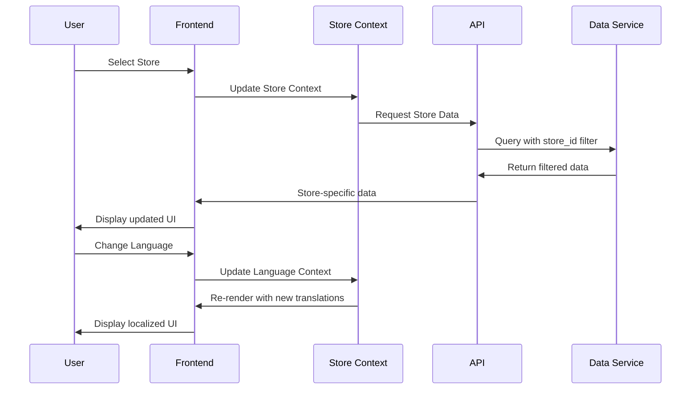

# Design Document

## Overview

This design document outlines the architecture and implementation approach for a comprehensive multi-store management and internationalization system. The system will provide complete data isolation between stores, seamless store switching, comprehensive internationalization across all frontend pages, and synchronized currency/regional formatting based on marketplace selection.

The solution consists of three main components:
1. **Backend API Enhancement** (port 3002) - Store-aware data services with complete isolation
2. **Frontend System Enhancement** (port 3000) - Multi-store UI with comprehensive i18n
3. **Admin System Enhancement** (port 3001) - Store management interface with data configuration

## Architecture

### System Architecture Overview


### Data Flow Architecture



## Components and Interfaces

### Frontend Components

#### Store Context Provider
```typescript
interface StoreContextType {
  currentStore: StoreData | null;
  availableStores: StoreData[];
  switchStore: (storeId: string) => Promise<void>;
  isLoading: boolean;
  error: string | null;
}

const StoreContext = createContext<StoreContextType | null>(null);

export const StoreProvider: React.FC<{ children: React.ReactNode }> = ({ children }) => {
  const [currentStore, setCurrentStore] = useState<StoreData | null>(null);
  const [availableStores, setAvailableStores] = useState<StoreData[]>([]);
  const [isLoading, setIsLoading] = useState(false);
  const [error, setError] = useState<string | null>(null);

  const switchStore = async (storeId: string) => {
    setIsLoading(true);
    try {
      const store = await storeApi.getStore(storeId);
      setCurrentStore(store);
      // Update marketplace in global store
      useStore.getState().setMarketplace(store.marketplace);
      // Refresh all data for new store
      queryClient.invalidateQueries();
    } catch (err) {
      setError(err.message);
    } finally {
      setIsLoading(false);
    }
  };

  return (
    <StoreContext.Provider value={{ currentStore, availableStores, switchStore, isLoading, error }}>
      {children}
    </StoreContext.Provider>
  );
};
```

#### Enhanced Store Selector Component
```typescript
interface StoreData {
  id: string;
  name: string;
  marketplace: Marketplace;
  currency_symbol: string;
  is_active: boolean;
  description?: string;
}

const StoreSelector: React.FC = () => {
  const { currentStore, availableStores, switchStore } = useStoreContext();
  const { t } = useI18n();
  const [isOpen, setIsOpen] = useState(false);

  return (
    <div className="relative">
      <div
        onClick={() => setIsOpen(!isOpen)}
        className="flex items-center px-2 cursor-pointer bg-white/95 border border-gray-200 rounded-sm"
      >
        <span className="text-xs font-bold text-amazon-text">
          {currentStore?.name || t('selectStore')}
        </span>
        <span className="text-xs text-gray-500 mx-1">|</span>
        <span className="text-xs font-bold text-amazon-text flex items-center gap-1">
          {currentStore?.marketplace || t('selectMarketplace')}
          <ChevronDown size={12} />
        </span>
      </div>

      {isOpen && (
        <div className="absolute top-8 left-0 w-64 bg-white shadow-xl border border-gray-200 py-2 rounded-b-sm z-100">
          <div className="px-4 py-2 text-xs font-black text-gray-400 uppercase tracking-widest border-b mb-1">
            {t('selectStore')}
          </div>
          {availableStores.map((store) => (
            <div
              key={store.id}
              onClick={() => {
                switchStore(store.id);
                setIsOpen(false);
              }}
              className="px-4 py-2.5 hover:bg-gray-100 flex items-center justify-between cursor-pointer"
            >
              <div className="flex flex-col">
                <span className="text-sm font-medium text-amazon-text">
                  {store.name}
                </span>
                <span className="text-xs text-gray-500">
                  {store.marketplace} • {store.currency_symbol}
                </span>
              </div>
              {currentStore?.id === store.id && (
                <Check size={16} className="text-amazon-teal" />
              )}
            </div>
          ))}
        </div>
      )}
    </div>
  );
};
```

#### Enhanced Internationalization Hook
```typescript
interface I18nContextType {
  language: Language;
  setLanguage: (lang: Language) => void;
  t: (key: string, params?: Record<string, any>) => string;
  formatCurrency: (amount: number, marketplace?: Marketplace) => string;
  formatNumber: (num: number) => string;
  formatDate: (date: Date) => string;
}

export const useI18n = (): I18nContextType => {
  const { session, setLanguage: setGlobalLanguage } = useStore();
  const { currentStore } = useStoreContext();
  
  const setLanguage = (lang: Language) => {
    setGlobalLanguage(lang);
    // Update document language
    document.documentElement.lang = lang;
  };

  const t = (key: string, params?: Record<string, any>) => {
    const translation = translations[session.language]?.[key] ?? key;
    
    if (params && typeof translation === 'string') {
      return Object.entries(params).reduce(
        (str, [param, value]) => str.replace(new RegExp(`\\{${param}\\}`, 'g'), String(value)),
        translation
      );
    }
    
    return translation;
  };

  const formatCurrency = (amount: number, marketplace?: Marketplace) => {
    const market = marketplace || currentStore?.marketplace || session.marketplace;
    const config = marketplaceConfigs[market];
    
    return new Intl.NumberFormat(session.language, {
      style: 'currency',
      currency: config.symbol,
      currencyDisplay: 'symbol'
    }).format(amount);
  };

  const formatNumber = (num: number) => {
    return new Intl.NumberFormat(session.language).format(num);
  };

  const formatDate = (date: Date) => {
    return new Intl.DateTimeFormat(session.language).format(date);
  };

  return {
    language: session.language,
    setLanguage,
    t,
    formatCurrency,
    formatNumber,
    formatDate
  };
};
```

### Backend API Components

#### Store-Aware Data Service
```typescript
class StoreAwareDataService {
  private dataDir: string;

  constructor(dataDir: string = './data') {
    this.dataDir = dataDir;
  }

  // Read data with store filtering
  async readStoreData<T extends { store_id: string }>(
    collection: string, 
    storeId: string
  ): Promise<T[]> {
    const allData = await this.readData<T>(collection);
    return allData.filter(item => item.store_id === storeId);
  }

  // Create data with store association
  async createStoreData<T extends { store_id: string }>(
    collection: string,
    data: Omit<T, 'id' | 'created_at' | 'updated_at'> & { store_id: string }
  ): Promise<T> {
    const newItem = {
      ...data,
      id: generateId(),
      created_at: new Date().toISOString(),
      updated_at: new Date().toISOString(),
    } as T;

    const allData = await this.readData<T>(collection);
    allData.push(newItem);
    await this.writeData(collection, allData);
    
    return newItem;
  }

  // Update with store validation
  async updateStoreData<T extends { store_id: string }>(
    collection: string,
    id: string,
    storeId: string,
    updates: Partial<T>
  ): Promise<T | null> {
    const allData = await this.readData<T>(collection);
    const index = allData.findIndex(item => item.id === id && item.store_id === storeId);
    
    if (index === -1) return null;
    
    allData[index] = {
      ...allData[index],
      ...updates,
      updated_at: new Date().toISOString(),
    };
    
    await this.writeData(collection, allData);
    return allData[index];
  }

  // Delete with store validation
  async deleteStoreData<T extends { store_id: string }>(
    collection: string,
    id: string,
    storeId: string
  ): Promise<boolean> {
    const allData = await this.readData<T>(collection);
    const index = allData.findIndex(item => item.id === id && item.store_id === storeId);
    
    if (index === -1) return false;
    
    allData.splice(index, 1);
    await this.writeData(collection, allData);
    return true;
  }

  // Bulk operations for store data
  async bulkCreateStoreData<T extends { store_id: string }>(
    collection: string,
    items: Array<Omit<T, 'id' | 'created_at' | 'updated_at'> & { store_id: string }>
  ): Promise<T[]> {
    const timestamp = new Date().toISOString();
    const newItems = items.map(item => ({
      ...item,
      id: generateId(),
      created_at: timestamp,
      updated_at: timestamp,
    })) as T[];

    const allData = await this.readData<T>(collection);
    allData.push(...newItems);
    await this.writeData(collection, allData);
    
    return newItems;
  }
}
```

#### Store Validation Middleware
```typescript
export const validateStoreAccess = (
  req: Request,
  res: Response,
  next: NextFunction
) => {
  const storeId = req.params.storeId || req.body.store_id || req.query.store_id;
  
  if (!storeId) {
    return res.status(400).json({
      success: false,
      error: 'Store ID is required'
    });
  }

  // Validate store exists
  const stores = dataService.readData<Store>('stores');
  const storeExists = stores.some(store => store.id === storeId);
  
  if (!storeExists) {
    return res.status(404).json({
      success: false,
      error: 'Store not found'
    });
  }

  // Add store context to request
  req.storeContext = { storeId };
  next();
};
```

### Admin System Components

#### Store Management Interface
```typescript
const StoreManagement: React.FC = () => {
  const [stores, setStores] = useState<Store[]>([]);
  const [selectedStore, setSelectedStore] = useState<Store | null>(null);
  const [isModalVisible, setIsModalVisible] = useState(false);
  const [form] = Form.useForm();

  const columns = [
    {
      title: '店铺名称',
      dataIndex: 'name',
      key: 'name',
      render: (name: string, record: Store) => (
        <Space>
          <ShopOutlined />
          <span style={{ fontWeight: 'bold' }}>{name}</span>
          {!record.is_active && <Tag color="red">未激活</Tag>}
        </Space>
      ),
    },
    {
      title: '市场',
      dataIndex: 'marketplace',
      key: 'marketplace',
      render: (marketplace: string, record: Store) => (
        <Space>
          <span>{marketplace}</span>
          <Tag color="blue">{record.currency_symbol}</Tag>
        </Space>
      ),
    },
    {
      title: '数据统计',
      key: 'stats',
      render: (_, record: Store) => (
        <Button 
          type="link" 
          onClick={() => handleViewStats(record)}
        >
          查看统计
        </Button>
      ),
    },
    {
      title: '操作',
      key: 'actions',
      render: (_, record: Store) => (
        <Space>
          <Button type="link" onClick={() => handleEdit(record)}>
            编辑
          </Button>
          <Popconfirm
            title="确定删除此店铺？"
            description="删除店铺将同时删除所有相关数据，此操作不可恢复。"
            onConfirm={() => handleDelete(record.id)}
          >
            <Button type="link" danger>删除</Button>
          </Popconfirm>
        </Space>
      ),
    },
  ];

  return (
    <div>
      <Title level={2}>店铺管理</Title>
      
      <div style={{ marginBottom: 16 }}>
        <Button 
          type="primary" 
          icon={<PlusOutlined />}
          onClick={() => setIsModalVisible(true)}
        >
          新增店铺
        </Button>
      </div>

      <Table
        columns={columns}
        dataSource={stores}
        rowKey="id"
        pagination={{
          showSizeChanger: true,
          showQuickJumper: true,
        }}
      />

      <Modal
        title="店铺配置"
        open={isModalVisible}
        onCancel={() => setIsModalVisible(false)}
        footer={null}
      >
        <Form form={form} layout="vertical" onFinish={handleSubmit}>
          <Form.Item
            label="店铺名称"
            name="name"
            rules={[{ required: true, message: '请输入店铺名称' }]}
          >
            <Input />
          </Form.Item>
          
          <Form.Item
            label="市场"
            name="marketplace"
            rules={[{ required: true, message: '请选择市场' }]}
          >
            <Select>
              <Option value="United States">United States</Option>
              <Option value="Japan">Japan</Option>
              <Option value="United Kingdom">United Kingdom</Option>
              <Option value="Germany">Germany</Option>
              <Option value="Europe">Europe</Option>
            </Select>
          </Form.Item>
          
          <Form.Item>
            <Space>
              <Button type="primary" htmlType="submit">
                保存
              </Button>
              <Button onClick={() => setIsModalVisible(false)}>
                取消
              </Button>
            </Space>
          </Form.Item>
        </Form>
      </Modal>
    </div>
  );
};
```

## Data Models

### Enhanced Store Model
```typescript
export const StoreSchema = z.object({
  id: z.string(),
  name: z.string().min(1).max(100),
  marketplace: z.enum(['United States', 'Japan', 'United Kingdom', 'Germany', 'Europe']),
  currency_symbol: z.string(),
  country: z.string(),
  timezone: z.string().default('UTC'),
  business_type: z.enum(['Individual', 'Business']).default('Business'),
  is_active: z.boolean().default(true),
  description: z.string().optional(),
  settings: z.object({
    default_language: z.enum(['en-US', 'zh-CN']).default('en-US'),
    tax_settings: z.object({
      tax_calculation_enabled: z.boolean().default(false),
      default_tax_rate: z.number().default(0),
    }).optional(),
    notification_settings: z.object({
      email_notifications: z.boolean().default(true),
      sms_notifications: z.boolean().default(false),
    }).optional(),
  }).optional(),
  created_at: z.string(),
  updated_at: z.string(),
});

export type Store = z.infer<typeof StoreSchema>;
```

### Store-Aware Data Models
```typescript
// All data models now include store_id for isolation
export const ProductSchema = z.object({
  id: z.string(),
  store_id: z.string(), // Required for data isolation
  title: z.string(),
  asin: z.string(),
  sku: z.string(),
  image_url: z.string().optional(),
  price: z.number(),
  inventory: z.number().int().default(0),
  fulfillment_type: z.enum(['FBA', 'FBM']).default('FBA'),
  status: z.enum(['Active', 'Inactive']).default('Active'),
  sales_amount: z.number().default(0),
  units_sold: z.number().int().default(0),
  page_views: z.number().int().default(0),
  created_at: z.string(),
  updated_at: z.string(),
});

export const OrderSchema = z.object({
  id: z.string(),
  store_id: z.string(), // Required for data isolation
  order_number: z.string(),
  customer_email: z.string(),
  total_amount: z.number(),
  status: z.enum(['Pending', 'Shipped', 'Delivered', 'Cancelled']),
  items: z.array(z.object({
    product_id: z.string(),
    quantity: z.number().int(),
    price: z.number(),
  })),
  shipping_address: z.object({
    name: z.string(),
    address_line1: z.string(),
    address_line2: z.string().optional(),
    city: z.string(),
    state: z.string(),
    postal_code: z.string(),
    country: z.string(),
  }),
  created_at: z.string(),
  updated_at: z.string(),
});

export const SalesDataSchema = z.object({
  id: z.string(),
  store_id: z.string(), // Required for data isolation
  date: z.string(),
  sales_amount: z.number(),
  units_sold: z.number().int(),
  orders_count: z.number().int(),
  avg_order_value: z.number(),
  created_at: z.string(),
});
```

### Internationalization Data Model
```typescript
export interface TranslationEntry {
  key: string;
  en_US: string;
  zh_CN: string;
  context?: string;
  category: 'navigation' | 'forms' | 'messages' | 'dashboard' | 'inventory' | 'orders' | 'reports';
}

export interface MarketplaceConfig {
  id: Marketplace;
  name: string;
  currency_code: string;
  currency_symbol: string;
  locale: string;
  number_format: {
    decimal_separator: string;
    thousand_separator: string;
    decimal_places: number;
  };
  date_format: string;
  timezone: string;
}

// Enhanced marketplace configurations
export const marketplaceConfigs: Record<Marketplace, MarketplaceConfig> = {
  'United States': {
    id: 'United States',
    name: 'United States',
    currency_code: 'USD',
    currency_symbol: '$',
    locale: 'en-US',
    number_format: {
      decimal_separator: '.',
      thousand_separator: ',',
      decimal_places: 2,
    },
    date_format: 'MM/DD/YYYY',
    timezone: 'America/New_York',
  },
  'Japan': {
    id: 'Japan',
    name: 'Japan',
    currency_code: 'JPY',
    currency_symbol: '¥',
    locale: 'ja-JP',
    number_format: {
      decimal_separator: '.',
      thousand_separator: ',',
      decimal_places: 0,
    },
    date_format: 'YYYY/MM/DD',
    timezone: 'Asia/Tokyo',
  },
  // ... other marketplaces
};
```

Now I need to use the prework tool to analyze the acceptance criteria before writing correctness properties:

<function_calls>
<invoke name="prework">
<parameter name="featureName">multi-store-internationalization-system

## Correctness Properties

*A property is a characteristic or behavior that should hold true across all valid executions of a system—essentially, a formal statement about what the system should do. Properties serve as the bridge between human-readable specifications and machine-verifiable correctness guarantees.*

Based on the prework analysis, the following properties have been identified to validate the system's correctness:

### Property 1: Store Data Isolation
*For any* two different stores, data operations on one store should never affect or return data from another store
**Validates: Requirements 1.2, 1.3**

### Property 2: Store Creation Completeness
*For any* new store creation, all required data containers (products, orders, sales, etc.) should be properly initialized and isolated
**Validates: Requirements 1.1**

### Property 3: Store Deletion Cleanup
*For any* store deletion operation, only data belonging to that specific store should be removed while preserving all other stores' data
**Validates: Requirements 1.5**

### Property 4: Store Context Synchronization
*For any* store selection change, all displayed data should update to reflect only the selected store's information
**Validates: Requirements 2.2, 2.3**

### Property 5: Marketplace Configuration Consistency
*For any* store with an associated marketplace, all currency symbols and regional formatting should match the marketplace configuration
**Validates: Requirements 3.2, 3.4, 5.1, 5.3**

### Property 6: Language Switching Completeness
*For any* language change operation, all interface text should update immediately without any mixed-language content remaining
**Validates: Requirements 4.1, 4.2**

### Property 7: Locale-Specific Formatting
*For any* numerical, currency, or date display, the formatting should match the selected locale conventions
**Validates: Requirements 4.3, 5.2**

### Property 8: API Store Context Validation
*For any* API request requiring store context, invalid or missing store_id parameters should result in appropriate error responses
**Validates: Requirements 6.1, 6.3**

### Property 9: Data Query Filtering
*For any* database query in a store context, results should be filtered to include only data belonging to the specified store
**Validates: Requirements 6.2**

### Property 10: Real-time Data Synchronization
*For any* data modification in the Admin System, the changes should be immediately reflected in the Frontend System without requiring manual refresh
**Validates: Requirements 8.1, 8.3**

### Property 11: Internationalization Coverage
*For any* page or component in the system, all text elements should have corresponding translations in both supported languages
**Validates: Requirements 9.1, 9.2, 9.3, 9.4, 9.5**

### Property 12: Session Persistence
*For any* user session, store selection and language preferences should persist across browser restarts
**Validates: Requirements 2.5, 4.4**

### Property 13: Currency Symbol Consistency
*For any* marketplace selection, all monetary values throughout the application should display with the correct currency symbol
**Validates: Requirements 5.4, 5.5**

### Property 14: Store Management CRUD Operations
*For any* store management operation (create, read, update, delete), the operation should complete successfully with proper validation and error handling
**Validates: Requirements 7.1, 7.2, 7.4**

### Property 15: Data Caching Correctness
*For any* store-specific data caching, cached data should be invalidated and refreshed when switching between stores
**Validates: Requirements 10.3**

## Error Handling

### Store Context Errors
- **Missing Store Context**: When no store is selected, display appropriate guidance message
- **Invalid Store ID**: Return 404 error with descriptive message
- **Store Access Denied**: Return 403 error for unauthorized store access
- **Store Not Found**: Handle gracefully with fallback to available stores

### Data Synchronization Errors
- **API Connection Failures**: Implement retry logic with exponential backoff
- **Data Consistency Conflicts**: Provide conflict resolution mechanisms
- **Concurrent Access Issues**: Use optimistic locking for data updates
- **Cache Invalidation Failures**: Implement cache refresh mechanisms

### Internationalization Errors
- **Missing Translations**: Fall back to key name or default language
- **Locale Loading Failures**: Graceful degradation to default locale
- **Currency Formatting Errors**: Fall back to basic number formatting
- **Date/Time Formatting Issues**: Use ISO format as fallback

### Admin System Errors
- **Store Creation Failures**: Validate all required fields and provide clear error messages
- **Bulk Operation Failures**: Provide detailed failure reports with partial success handling
- **Data Import Errors**: Validate data format and provide error details
- **Configuration Update Failures**: Roll back changes and notify user

## Testing Strategy

### Dual Testing Approach
The system will employ both unit testing and property-based testing to ensure comprehensive coverage:

**Unit Tests** will focus on:
- Specific examples and edge cases
- Integration points between components
- Error conditions and boundary cases
- UI component behavior and interactions

**Property-Based Tests** will focus on:
- Universal properties that hold for all inputs
- Data isolation and consistency across stores
- Internationalization completeness
- API behavior across different store contexts

### Property-Based Testing Configuration
- **Testing Library**: Use `fast-check` for TypeScript/JavaScript property-based testing
- **Test Iterations**: Minimum 100 iterations per property test
- **Test Tagging**: Each property test must reference its design document property
- **Tag Format**: `Feature: multi-store-internationalization-system, Property {number}: {property_text}`

### Testing Coverage Areas

#### Frontend Testing
- Store context switching and data updates
- Language switching and translation completeness
- Currency formatting across different marketplaces
- UI component behavior with different store/language combinations
- Session persistence and restoration

#### Backend API Testing
- Store-based data filtering and isolation
- API endpoint validation with store context
- Data consistency across store operations
- Error handling for invalid store contexts
- Bulk operations and data integrity

#### Admin System Testing
- Store CRUD operations and validation
- Data configuration and synchronization
- Bulk data operations and error handling
- Store statistics and metrics accuracy

#### Integration Testing
- End-to-end store switching workflows
- Real-time data synchronization between admin and frontend
- Cross-system data consistency validation
- Performance testing for store operations

### Test Data Management
- **Isolated Test Stores**: Create separate test stores for each test suite
- **Data Cleanup**: Ensure test data is properly cleaned up after tests
- **Mock Data Generation**: Generate realistic test data for different store configurations
- **Internationalization Test Data**: Include test data in multiple languages and locales