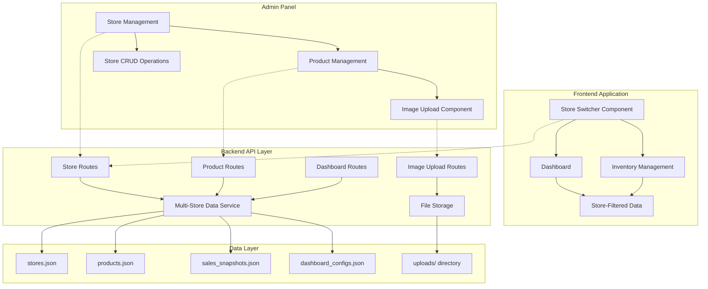

# Design Document

## Overview

This design enhances the Amazon Seller Central clone with comprehensive multi-store management capabilities and integrated product image upload functionality. The enhancement transforms the current single-store system into a scalable multi-tenant architecture while maintaining data isolation and adding seamless image management workflows.

The design introduces three key architectural improvements:
1. **Multi-Store Architecture**: Extends the existing data service with store-aware filtering and CRUD operations
2. **Enhanced Admin Panel**: Adds comprehensive store management and integrated image upload workflows
3. **Dynamic Frontend Integration**: Implements store switching with real-time data updates and persistent state management

## Architecture

### System Architecture Overview



### Multi-Store Data Architecture

The system implements a store-centric data model where each data entity is associated with a specific store through a `store_id` foreign key relationship:

- **Store Entity**: Primary entity containing store configuration (name, marketplace, currency)
- **Associated Data**: All business data (products, sales, dashboard configs) linked via `store_id`
- **Data Isolation**: API layer enforces store-based filtering for all operations
- **Referential Integrity**: Cascade operations maintain consistency when stores are deleted

## Components and Interfaces

### Backend Components

#### Enhanced Data Service
```typescript
class DataService {
  // Existing methods enhanced with store filtering
  async findByStoreId<T extends { store_id: string }>(filename: string, storeId: string): Promise<T[]>
  async deleteByStoreId<T extends { store_id: string }>(filename: string, storeId: string): Promise<number>
  
  // New multi-store operations
  async createWithStoreId<T>(filename: string, storeId: string, item: Omit<T, 'id' | 'store_id'>): Promise<T>
  async bulkDeleteByStoreId(storeId: string): Promise<void>
}
```

#### Store Management API
```typescript
// GET /api/stores - List all stores
// POST /api/stores - Create new store
// PUT /api/stores/:id - Update store
// DELETE /api/stores/:id - Delete store and all associated data
// GET /api/stores/:id/summary - Get store summary with data counts
```

#### Enhanced Product API
```typescript
// All existing endpoints enhanced with store_id filtering
// POST /api/products - Now requires store_id in request body
// GET /api/products?store_id=:id - Filter products by store
// POST /api/products/:id/image - Enhanced with validation and error handling
```

### Frontend Components

#### Store Switcher Component
```typescript
interface StoreSwitcherProps {
  currentStore: Store;
  onStoreChange: (store: Store) => void;
  stores: Store[];
}

const StoreSwitcher: React.FC<StoreSwitcherProps> = ({
  currentStore,
  onStoreChange,
  stores
}) => {
  // Dropdown interface for store selection
  // Displays store name and marketplace flag
  // Persists selection to localStorage
  // Triggers data refresh on change
}
```

#### Enhanced Dashboard Component
```typescript
const Dashboard: React.FC = () => {
  const { currentStore } = useStore();
  
  // All data fetching now includes store_id parameter
  const { data: snapshot } = useQuery({
    queryKey: ['dashboard', currentStore.id],
    queryFn: () => backendApi.getDashboardSnapshot(currentStore.id)
  });
  
  // Dynamic header updates with store name
  // All metrics filtered by current store
}
```

### Admin Panel Components

#### Store Management Interface
```typescript
const StoreManagement: React.FC = () => {
  // Table view of all stores with CRUD operations
  // Store creation modal with validation
  // Store deletion with cascade confirmation
  // Store summary statistics (product count, sales data)
}
```

#### Enhanced Product Management
```typescript
const ProductManagement: React.FC = () => {
  // Store selector for filtering products
  // Integrated image upload in create/edit forms
  // Drag-and-drop image upload with preview
  // Image validation and error handling
  // Bulk operations with store context
}
```

#### Image Upload Component
```typescript
interface ImageUploadProps {
  productId?: string;
  currentImage?: string;
  onImageUploaded: (imageUrl: string) => void;
  onError: (error: string) => void;
}

const ImageUpload: React.FC<ImageUploadProps> = ({
  productId,
  currentImage,
  onImageUploaded,
  onError
}) => {
  // React Dropzone integration
  // Image preview functionality
  // Upload progress indication
  // Error handling and validation
  // Support for replace existing image
}
```

## Data Models

### Enhanced Store Schema
```typescript
const StoreSchema = z.object({
  id: z.string(),
  name: z.string().min(1).max(100),
  country: z.string().default('United States'),
  currency_symbol: z.string().default('US$'),
  marketplace: z.enum(['United States', 'Japan', 'United Kingdom', 'Germany', 'Europe']),
  is_active: z.boolean().default(true),
  created_at: z.string(),
  updated_at: z.string(),
  
  // New fields for enhanced management
  description: z.string().optional(),
  timezone: z.string().default('UTC'),
  business_type: z.enum(['Individual', 'Business']).default('Business'),
  
  // Statistics (computed fields)
  product_count: z.number().int().default(0),
  total_sales: z.number().default(0),
  last_activity: z.string().optional(),
});
```

### Enhanced Product Schema
```typescript
const ProductSchema = z.object({
  // Existing fields remain unchanged
  id: z.string(),
  store_id: z.string(), // Foreign key to stores
  title: z.string(),
  asin: z.string(),
  sku: z.string(),
  price: z.number(),
  inventory: z.number().int().default(0),
  status: z.enum(['Active', 'Inactive']).default('Active'),
  
  // Enhanced image handling
  image_url: z.string().optional(),
  image_filename: z.string().optional(), // Original filename for reference
  image_size: z.number().optional(), // File size in bytes
  image_uploaded_at: z.string().optional(),
  
  // Existing fields
  fulfillment_type: z.enum(['FBA', 'FBM']).default('FBA'),
  sales_amount: z.number().default(0),
  units_sold: z.number().int().default(0),
  page_views: z.number().int().default(0),
  created_at: z.string(),
  updated_at: z.string(),
});
```

### Store Summary Schema
```typescript
const StoreSummarySchema = z.object({
  store: StoreSchema,
  statistics: z.object({
    product_count: z.number().int(),
    active_products: z.number().int(),
    total_sales: z.number(),
    total_orders: z.number().int(),
    avg_order_value: z.number(),
    last_sale_date: z.string().optional(),
  }),
  health_metrics: z.object({
    inventory_performance_index: z.number().int().default(400),
    order_defect_rate: z.number().default(0),
    late_shipment_rate: z.number().default(0),
  }),
});
```

## API Specifications

### Store Management Endpoints

#### GET /api/stores
```typescript
Response: {
  success: boolean;
  data: Store[];
  pagination?: PaginationInfo;
}
```

#### POST /api/stores
```typescript
Request: {
  name: string;
  country: string;
  currency_symbol: string;
  marketplace: Marketplace;
  description?: string;
  timezone?: string;
  business_type?: 'Individual' | 'Business';
}

Response: {
  success: boolean;
  data: Store;
  message: string;
}
```

#### DELETE /api/stores/:id
```typescript
Response: {
  success: boolean;
  message: string;
  deleted_data: {
    products: number;
    sales_records: number;
    dashboard_configs: number;
  };
}
```

### Enhanced Product Endpoints

#### GET /api/products
```typescript
Query Parameters: {
  store_id: string; // Required for multi-store filtering
  status?: 'Active' | 'Inactive' | 'All';
  search?: string;
  page?: number;
  limit?: number;
}
```

#### POST /api/products/:id/image
```typescript
Request: FormData with 'image' field
Response: {
  success: boolean;
  data: {
    image_url: string;
    image_filename: string;
    image_size: number;
  };
  message: string;
}
```

### Frontend API Integration

#### Store State Management
```typescript
interface StoreState {
  stores: Store[];
  currentStore: Store | null;
  isLoading: boolean;
  error: string | null;
}

interface StoreActions {
  fetchStores: () => Promise<void>;
  setCurrentStore: (store: Store) => void;
  createStore: (storeData: CreateStoreRequest) => Promise<Store>;
  updateStore: (id: string, updates: Partial<Store>) => Promise<Store>;
  deleteStore: (id: string) => Promise<void>;
}
```

#### Enhanced Zustand Store
```typescript
interface AppStore extends StoreState, StoreActions {
  // Existing session and dashboard state
  session: UserSession;
  dashboard: DashboardState;
  
  // Enhanced with store management
  refreshDashboardForStore: (storeId: string) => Promise<void>;
  switchStore: (store: Store) => Promise<void>;
}
```

## Correctness Properties

*A property is a characteristic or behavior that should hold true across all valid executions of a system-essentially, a formal statement about what the system should do. Properties serve as the bridge between human-readable specifications and machine-verifiable correctness guarantees.*

### Property 1: Store Data Isolation
*For any* API request with a store ID parameter, all returned data should belong exclusively to that specified store and contain no data from other stores
**Validates: Requirements 4.1, 4.2, 4.3, 4.4, 5.1, 5.2**

### Property 2: Store CRUD Operations Integrity
*For any* valid store creation, update, or deletion operation, the system should maintain data consistency, generate unique identifiers, and preserve referential integrity
**Validates: Requirements 1.2, 1.3, 1.4, 5.3**

### Property 3: Store Name Uniqueness
*For any* store creation or update request, if the store name already exists in the system, the operation should be rejected with appropriate error messaging
**Validates: Requirements 1.5**

### Property 4: Timestamp and Audit Trail Maintenance
*For any* store modification operation, the system should update the updated_at timestamp and maintain audit trail information
**Validates: Requirements 1.6**

### Property 5: Store Switching Data Consistency
*For any* store selection change in the frontend, all displayed data, UI elements, and dashboard metrics should update to reflect only the selected store's information
**Validates: Requirements 2.2, 2.3, 2.6**

### Property 6: Store Selection Persistence
*For any* store selection made by a user, the choice should be persisted in browser storage and restored in subsequent sessions
**Validates: Requirements 2.4**

### Property 7: Image Upload Validation
*For any* file upload attempt, the system should validate file type (JPEG, PNG, GIF, WebP), size (≤5MB), and format, rejecting invalid files with descriptive error messages
**Validates: Requirements 3.3, 3.5**

### Property 8: Image Upload Success Handling
*For any* successful image upload, the system should update the product record with the new image URL, filename, and metadata
**Validates: Requirements 3.6**

### Property 9: Image Preview Functionality
*For any* product with an image (existing or newly uploaded), the system should provide preview functionality in the product management interface
**Validates: Requirements 3.2, 3.7**

### Property 10: Data Association with Store Context
*For any* new data record creation (products, sales, configurations), the system should automatically associate the record with the current store context via store_id
**Validates: Requirements 4.5, 4.6**

### Property 11: Error Handling Consistency
*For any* system error condition (API failures, validation errors, upload failures), the system should return descriptive error messages with appropriate HTTP status codes and maintain application state
**Validates: Requirements 3.4, 5.5**

### Property 12: Batch Operations Efficiency
*For any* batch operation request involving multiple stores, the system should handle all operations atomically and efficiently without data corruption
**Validates: Requirements 5.4**

### Property 13: Backward Compatibility Preservation
*For any* existing single-store API usage pattern, the system should continue to function correctly while supporting the new multi-store capabilities
**Validates: Requirements 5.6**

## Error Handling

### API Error Responses
The system implements comprehensive error handling with standardized response formats:

```typescript
interface ErrorResponse {
  success: false;
  error: string;
  message: string;
  code: string;
  details?: any;
}
```

### Error Categories

#### Validation Errors (400)
- Invalid store data (missing required fields, invalid formats)
- Duplicate store names
- Invalid image file types or sizes
- Malformed request parameters

#### Authorization Errors (403)
- Cross-store data access attempts
- Insufficient permissions for store operations

#### Not Found Errors (404)
- Store not found
- Product not found
- Image file not found

#### Conflict Errors (409)
- Store name already exists
- Concurrent modification conflicts

#### Server Errors (500)
- File system errors during image upload
- Database operation failures
- Unexpected system errors

### Error Recovery Strategies

#### Frontend Error Handling
```typescript
const handleApiError = (error: ApiError) => {
  switch (error.code) {
    case 'STORE_NOT_FOUND':
      // Redirect to store selection
      navigate('/admin/stores');
      break;
    case 'DUPLICATE_STORE_NAME':
      // Show inline validation error
      setFieldError('name', error.message);
      break;
    case 'IMAGE_UPLOAD_FAILED':
      // Maintain form state, show error message
      setUploadError(error.message);
      break;
    default:
      // Show generic error notification
      notification.error({ message: error.message });
  }
};
```

#### Backend Error Middleware
```typescript
const errorHandler = (error: Error, req: Request, res: Response, next: NextFunction) => {
  const errorResponse: ErrorResponse = {
    success: false,
    error: error.name,
    message: error.message,
    code: getErrorCode(error),
  };
  
  // Log error for monitoring
  logger.error('API Error:', { error, request: req.url, method: req.method });
  
  res.status(getStatusCode(error)).json(errorResponse);
};
```

## Testing Strategy

### Dual Testing Approach

The system employs both unit testing and property-based testing for comprehensive coverage:

**Unit Tests**: Focus on specific examples, edge cases, and integration points
- Store creation with valid/invalid data
- Image upload with various file types and sizes
- UI component rendering and interactions
- API endpoint responses for specific scenarios
- Error handling for known failure cases

**Property Tests**: Verify universal properties across all inputs using fast-check library
- Minimum 100 iterations per property test
- Each test tagged with feature name and property reference
- Comprehensive input generation for robust validation

### Property-Based Testing Configuration

```typescript
// Example property test structure
describe('Multi-Store Management Properties', () => {
  it('Property 1: Store Data Isolation', () => {
    fc.assert(fc.property(
      fc.record({
        storeId: fc.string(),
        requestData: fc.object()
      }),
      async ({ storeId, requestData }) => {
        const result = await api.getProducts({ store_id: storeId });
        // Verify all returned products belong to specified store
        expect(result.data.every(product => product.store_id === storeId)).toBe(true);
      }
    ), { numRuns: 100 });
  });
  
  // Tag: Feature: multi-store-management-enhancement, Property 1: Store Data Isolation
});
```

### Testing Scenarios

#### Store Management Testing
- Store CRUD operations with various data combinations
- Cascade deletion verification
- Concurrent store operations
- Store name uniqueness validation
- Data isolation between stores

#### Image Upload Testing
- File type validation (valid and invalid formats)
- File size validation (within and exceeding limits)
- Upload progress and error handling
- Image preview functionality
- Concurrent upload operations

#### Frontend Integration Testing
- Store switching with data refresh
- Persistent store selection
- UI updates across components
- Error state handling
- Loading state management

#### API Integration Testing
- Multi-store parameter handling
- Backward compatibility verification
- Error response consistency
- Batch operation atomicity
- Cross-store access prevention

### Performance Testing

#### Load Testing Scenarios
- Multiple concurrent store operations
- Bulk product creation across stores
- Large image file uploads
- Store switching with large datasets
- API response times under load

#### Memory and Storage Testing
- Image storage efficiency
- JSON file performance with multiple stores
- Memory usage during bulk operations
- File system cleanup after store deletion

The testing strategy ensures robust validation of both functional correctness and system performance under various load conditions while maintaining the existing system's reliability.