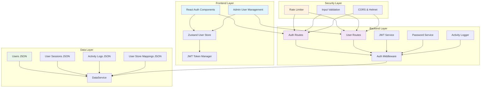

# Design Document

## Overview

The User Management System provides a comprehensive authentication, authorization, and user administration solution for the Amazon Seller Central clone project. The system integrates seamlessly with the existing multi-store architecture, providing role-based access control, secure JWT-based authentication, and administrative capabilities through both API endpoints and admin interface components.

The design follows the existing project patterns using Node.js/Express backend with JSON file storage, React frontend with Zustand state management, and TypeScript throughout for type safety. The system implements industry-standard security practices including bcrypt password hashing, JWT tokens, rate limiting, and comprehensive audit logging.

## Architecture

### System Components



### Integration Points

The User Management System integrates with existing components:

1. **Store Management**: Users are associated with stores through user-store mappings
2. **Admin Interface**: Extends the existing backend-admin with user management pages
3. **Frontend Authentication**: Enhances existing AuthPages with JWT token management
4. **API Security**: Adds authentication middleware to protect existing endpoints
5. **Data Service**: Utilizes existing DataService patterns for user data operations

## Components and Interfaces

### Backend Components

#### Authentication Service
```typescript
interface AuthService {
  // User authentication
  authenticateUser(username: string, password: string): Promise<AuthResult>;
  generateOTP(userId: string): Promise<string>;
  verifyOTP(userId: string, otp: string): Promise<boolean>;
  
  // Password management
  hashPassword(password: string): Promise<string>;
  verifyPassword(password: string, hash: string): Promise<boolean>;
  validatePasswordStrength(password: string): ValidationResult;
}

interface AuthResult {
  success: boolean;
  user?: User;
  requiresOTP?: boolean;
  error?: string;
}
```

#### JWT Token Service
```typescript
interface JWTService {
  generateToken(payload: TokenPayload): string;
  verifyToken(token: string): Promise<TokenPayload>;
  refreshToken(token: string): Promise<string>;
  blacklistToken(token: string): Promise<void>;
  isTokenBlacklisted(token: string): Promise<boolean>;
}

interface TokenPayload {
  userId: string;
  email: string;
  role: UserRole;
  storeIds: string[];
  iat: number;
  exp: number;
}
```

#### Authorization Service
```typescript
interface AuthorizationService {
  checkPermission(user: User, resource: string, action: string): boolean;
  checkStoreAccess(user: User, storeId: string): boolean;
  getUserPermissions(user: User): Permission[];
  assignStoreToUser(userId: string, storeId: string): Promise<void>;
  removeStoreFromUser(userId: string, storeId: string): Promise<void>;
}

interface Permission {
  resource: string;
  actions: string[];
  storeIds?: string[];
}
```

#### User Management Service
```typescript
interface UserManagementService {
  createUser(userData: CreateUserRequest): Promise<User>;
  updateUser(userId: string, updates: UpdateUserRequest): Promise<User>;
  deleteUser(userId: string): Promise<void>;
  getUserById(userId: string): Promise<User | null>;
  getUserByEmail(email: string): Promise<User | null>;
  listUsers(filters: UserFilters): Promise<PaginatedResponse<User>>;
  changePassword(userId: string, currentPassword: string, newPassword: string): Promise<void>;
}
```

#### Activity Logger Service
```typescript
interface ActivityLoggerService {
  logActivity(activity: ActivityLog): Promise<void>;
  getActivityLogs(filters: ActivityLogFilters): Promise<PaginatedResponse<ActivityLog>>;
  logAuthEvent(event: AuthEvent): Promise<void>;
  logSecurityEvent(event: SecurityEvent): Promise<void>;
  cleanupOldLogs(retentionDays: number): Promise<number>;
}
```

### Frontend Components

#### Enhanced Authentication Components
```typescript
interface AuthContextType {
  user: User | null;
  token: string | null;
  isAuthenticated: boolean;
  login: (credentials: LoginCredentials) => Promise<AuthResult>;
  logout: () => void;
  refreshToken: () => Promise<void>;
  checkPermission: (resource: string, action: string) => boolean;
  checkStoreAccess: (storeId: string) => boolean;
}

interface UserStoreState {
  // User state
  currentUser: User | null;
  token: string | null;
  isAuthenticated: boolean;
  
  // User management (admin)
  users: User[];
  usersLoading: boolean;
  usersError: string | null;
  
  // Actions
  setUser: (user: User) => void;
  setToken: (token: string) => void;
  clearAuth: () => void;
  loadUsers: () => Promise<void>;
  createUser: (userData: CreateUserRequest) => Promise<void>;
  updateUser: (userId: string, updates: UpdateUserRequest) => Promise<void>;
  deleteUser: (userId: string) => Promise<void>;
}
```

#### Admin User Management Interface
```typescript
interface UserManagementPageProps {
  selectedStoreId: string;
  selectedStore: Store;
  onStoreChange: (storeId: string, store: Store) => void;
}

interface UserFormProps {
  user?: User;
  onSubmit: (userData: CreateUserRequest | UpdateUserRequest) => Promise<void>;
  onCancel: () => void;
  loading?: boolean;
}

interface UserListProps {
  users: User[];
  loading: boolean;
  onEdit: (user: User) => void;
  onDelete: (userId: string) => void;
  onToggleStatus: (userId: string, isActive: boolean) => void;
}
```

### Middleware Components

#### Authentication Middleware
```typescript
interface AuthMiddleware {
  requireAuth: (req: Request, res: Response, next: NextFunction) => Promise<void>;
  optionalAuth: (req: Request, res: Response, next: NextFunction) => Promise<void>;
  requireRole: (roles: UserRole[]) => (req: Request, res: Response, next: NextFunction) => Promise<void>;
  requireStoreAccess: (req: Request, res: Response, next: NextFunction) => Promise<void>;
}
```

#### Rate Limiting Middleware
```typescript
interface RateLimitConfig {
  windowMs: number;
  max: number;
  message: string;
  standardHeaders: boolean;
  legacyHeaders: boolean;
}

interface SecurityMiddleware {
  authRateLimit: RateLimitConfig;
  apiRateLimit: RateLimitConfig;
  passwordResetRateLimit: RateLimitConfig;
}
```

## Data Models

### User Model
```typescript
interface User {
  id: string;
  email: string;
  username: string;
  password_hash: string;
  role: UserRole;
  profile: UserProfile;
  security: UserSecurity;
  preferences: UserPreferences;
  status: UserStatus;
  created_at: string;
  updated_at: string;
  last_login_at?: string;
}

interface UserProfile {
  display_name: string;
  phone?: string;
  timezone: string;
  language: Language;
}

interface UserSecurity {
  otp_secret: string;
  otp_code: string;
  password_reset_token?: string;
  password_reset_expires?: string;
  failed_login_attempts: number;
  locked_until?: string;
  two_factor_enabled: boolean;
}

interface UserPreferences {
  email_notifications: boolean;
  sms_notifications: boolean;
  theme: 'light' | 'dark';
  date_format: string;
  currency_display: string;
}

type UserRole = 'Admin' | 'Store Manager' | 'Viewer';
type UserStatus = 'Active' | 'Inactive' | 'Locked' | 'Pending';
```

### User-Store Mapping Model
```typescript
interface UserStoreMapping {
  id: string;
  user_id: string;
  store_id: string;
  role: StoreRole;
  permissions: StorePermission[];
  created_at: string;
  created_by: string;
}

type StoreRole = 'Owner' | 'Manager' | 'Viewer';

interface StorePermission {
  resource: string;
  actions: string[];
}
```

### Session Model
```typescript
interface UserSession {
  id: string;
  user_id: string;
  token_hash: string;
  device_info: DeviceInfo;
  ip_address: string;
  user_agent: string;
  created_at: string;
  expires_at: string;
  last_activity: string;
  is_active: boolean;
}

interface DeviceInfo {
  type: 'desktop' | 'mobile' | 'tablet';
  os: string;
  browser: string;
}
```

### Activity Log Model
```typescript
interface ActivityLog {
  id: string;
  user_id?: string;
  session_id?: string;
  event_type: ActivityEventType;
  resource: string;
  action: string;
  details: Record<string, any>;
  ip_address: string;
  user_agent: string;
  store_id?: string;
  timestamp: string;
  severity: 'info' | 'warning' | 'error' | 'critical';
}

type ActivityEventType = 
  | 'auth.login' 
  | 'auth.logout' 
  | 'auth.failed_login'
  | 'auth.password_reset'
  | 'user.created'
  | 'user.updated'
  | 'user.deleted'
  | 'permission.granted'
  | 'permission.revoked'
  | 'store.accessed'
  | 'api.request'
  | 'security.violation';
```

### Password Reset Model
```typescript
interface PasswordResetRequest {
  id: string;
  user_id: string;
  token: string;
  email: string;
  created_at: string;
  expires_at: string;
  used_at?: string;
  ip_address: string;
  user_agent: string;
}
```

## Correctness Properties

*A property is a characteristic or behavior that should hold true across all valid executions of a system—essentially, a formal statement about what the system should do. Properties serve as the bridge between human-readable specifications and machine-verifiable correctness guarantees.*

### Authentication Properties

**Property 1: User Registration Password Encryption**
*For any* user registration request with valid data, the system should create a user account where the stored password is bcrypt-encrypted and never stored in plain text
**Validates: Requirements 1.1**

**Property 2: Valid Login Authentication**
*For any* user with valid credentials in the system, authentication should succeed and return a valid JWT token containing user information
**Validates: Requirements 1.2**

**Property 3: Invalid Login Rejection**
*For any* login attempt with invalid credentials, the system should reject authentication and log the failed attempt with timestamp and IP address
**Validates: Requirements 1.3**

**Property 4: OTP Verification Completion**
*For any* user with a valid OTP code, verification should complete the login process, while invalid OTP codes should be rejected
**Validates: Requirements 1.4**

**Property 5: Password Complexity Enforcement**
*For any* password input, the system should enforce complexity requirements (minimum 8 characters, mixed case, numbers, special characters) and reject non-compliant passwords
**Validates: Requirements 1.5**

**Property 6: Default Role Assignment**
*For any* newly created user account, the system should assign the default role of "Viewer" regardless of other account properties
**Validates: Requirements 1.6**

### JWT Token Management Properties

**Property 7: JWT Token Generation**
*For any* successful authentication, the system should generate a JWT token containing user ID, role, store context, and proper expiration time
**Validates: Requirements 2.1**

**Property 8: JWT Token Validation**
*For any* JWT token presented to the system, validation should verify both signature authenticity and expiration status before granting access
**Validates: Requirements 2.2**

**Property 9: Expired Token Rejection**
*For any* expired JWT token, the system should reject the token and require re-authentication regardless of other token properties
**Validates: Requirements 2.3**

**Property 10: Token Refresh Capability**
*For any* valid non-expired JWT token, the system should support token refresh, while invalid or expired tokens should not be refreshable
**Validates: Requirements 2.4**

**Property 11: Logout Token Invalidation**
*For any* user logout action, the system should invalidate the current JWT token and add it to the blacklist
**Validates: Requirements 2.5**

**Property 12: Store Context in Tokens**
*For any* generated JWT token, the token payload should include store context information enabling multi-store operations
**Validates: Requirements 2.6**

### Authorization Properties

**Property 13: Admin Full Access**
*For any* user with Admin role accessing any system resource, the authorization service should grant full access regardless of the resource type
**Validates: Requirements 3.2**

**Property 14: Store Manager Limited Access**
*For any* user with Store Manager role, access should be granted only to resources within their assigned stores and denied for unassigned stores
**Validates: Requirements 3.3**

**Property 15: Viewer Read-Only Access**
*For any* user with Viewer role, access should be limited to read-only operations on resources within their assigned stores
**Validates: Requirements 3.4**

**Property 16: Unauthorized Access Denial**
*For any* user attempting to access resources beyond their permissions, the system should deny access and return a 403 Forbidden error
**Validates: Requirements 3.5**

**Property 17: Permission Validation on Endpoints**
*For any* protected API endpoint request, the authorization service should validate user permissions before allowing access to the resource
**Validates: Requirements 3.6**

### Profile Management Properties

**Property 18: Profile Update Validation**
*For any* user profile update request, the system should validate the input data and store updates only when validation passes
**Validates: Requirements 4.1**

**Property 19: Password Change Security**
*For any* password change request, the system should require verification of the current password before allowing the new password to be set
**Validates: Requirements 4.3**

**Property 20: Profile Change Audit Trail**
*For any* profile modification, the system should create an audit log entry with timestamp, changed fields, and user identification
**Validates: Requirements 4.4**

**Property 21: Email Update Verification**
*For any* email address change request, the system should require email verification before activating the new email address
**Validates: Requirements 4.5**

### Password Reset Properties

**Property 22: Reset Token Generation**
*For any* password reset request, the system should generate a cryptographically secure reset token with proper expiration time
**Validates: Requirements 5.1**

**Property 23: Reset Token Usage Validation**
*For any* password reset token usage, the system should validate token authenticity and expiration before allowing password changes
**Validates: Requirements 5.2**

**Property 24: Reset Token Expiration**
*For any* password reset token, the token should expire after exactly 1 hour and become unusable for password resets
**Validates: Requirements 5.3**

**Property 25: Session Invalidation on Password Reset**
*For any* successful password reset, the system should invalidate all existing user sessions to ensure security
**Validates: Requirements 5.4**

**Property 26: Password Reset Rate Limiting**
*For any* series of password reset requests from the same source, the system should enforce rate limiting to prevent abuse
**Validates: Requirements 5.6**

### Activity Logging Properties

**Property 27: Comprehensive Activity Logging**
*For any* user action in the system, the activity logger should record the event with timestamp, user ID, action details, and store context when applicable
**Validates: Requirements 6.1, 6.2, 6.3, 6.4, 6.6**

### Administrative Properties

**Property 28: Admin User Operations**
*For any* administrative user management operation (create, edit, deactivate), the system should execute the operation and maintain data consistency
**Validates: Requirements 7.2**

**Property 29: Bulk User Operations**
*For any* bulk user management operation, the system should process all valid operations and report results for each individual operation
**Validates: Requirements 7.3**

**Property 30: Store Assignment Updates**
*For any* admin action assigning store access to a user, the system should update user permissions and create proper user-store mappings
**Validates: Requirements 7.4**

### Store Integration Properties

**Property 31: User-Store Association Creation**
*For any* user assignment to a store, the system should create a proper mapping in the user-store association table
**Validates: Requirements 8.1**

**Property 32: Store Deletion Cleanup**
*For any* store deletion, the system should remove all associated user-store mappings to maintain referential integrity
**Validates: Requirements 8.2**

**Property 33: Store Access Validation**
*For any* store-specific API endpoint access, the authorization service should validate that the user has proper access to the target store
**Validates: Requirements 8.3**

**Property 34: Store Context Switching Validation**
*For any* user store context switch, the system should validate access permissions before allowing the context change
**Validates: Requirements 8.4**

**Property 35: User-Store Referential Integrity**
*For any* user-store relationship in the system, referential integrity should be maintained between user and store records
**Validates: Requirements 8.5**

### Security Properties

**Property 36: Login Rate Limiting**
*For any* series of login attempts from the same IP address, the system should enforce rate limiting (5 attempts per 15 minutes) and block excessive attempts
**Validates: Requirements 9.1**

**Property 37: IP Blocking on Rate Limit Violation**
*For any* IP address exceeding login rate limits, the system should temporarily block the IP address from making further requests
**Validates: Requirements 9.2**

**Property 38: Input Validation with Zod**
*For any* API request with input parameters, the system should validate all inputs using Zod schemas and reject invalid data
**Validates: Requirements 9.3**

**Property 39: Input Sanitization**
*For any* user input received by the system, all inputs should be sanitized to prevent injection attacks before processing
**Validates: Requirements 9.4**

**Property 40: Secure Error Logging**
*For any* API error that occurs, the system should log security-relevant information while ensuring no sensitive data is exposed in error messages
**Validates: Requirements 9.5**

### Data Privacy Properties

**Property 41: Bcrypt Password Encryption**
*For any* password stored in the system, it should be encrypted using bcrypt with a minimum of 12 rounds
**Validates: Requirements 10.1**

**Property 42: Sensitive Data Protection**
*For any* sensitive information in the system, it should never be logged or stored in plain text format
**Validates: Requirements 10.2**

**Property 43: User Data Deletion**
*For any* user account deletion, the system should securely remove all associated personal data from all system components
**Validates: Requirements 10.3**

**Property 44: User Data Export**
*For any* user data export request, the system should provide complete and accurate user account information in a structured format
**Validates: Requirements 10.4**

## Error Handling

### Authentication Errors
- **Invalid Credentials**: Return 401 Unauthorized with generic error message
- **Account Locked**: Return 423 Locked with lockout duration information
- **Rate Limited**: Return 429 Too Many Requests with retry-after header
- **Token Expired**: Return 401 Unauthorized requiring re-authentication
- **Invalid Token**: Return 401 Unauthorized with token validation error

### Authorization Errors
- **Insufficient Permissions**: Return 403 Forbidden with resource access denied
- **Store Access Denied**: Return 403 Forbidden with store-specific error message
- **Role Validation Failed**: Return 403 Forbidden with role requirement information

### Validation Errors
- **Input Validation**: Return 400 Bad Request with detailed field-level errors
- **Password Complexity**: Return 400 Bad Request with specific complexity requirements
- **Email Format**: Return 400 Bad Request with email validation requirements

### System Errors
- **Database Errors**: Return 500 Internal Server Error with generic message, log detailed error
- **JWT Service Errors**: Return 500 Internal Server Error, log JWT operation failures
- **Rate Limiter Errors**: Return 503 Service Unavailable with retry information

### Error Response Format
```typescript
interface ErrorResponse {
  success: false;
  error: string;
  message: string;
  details?: ValidationError[];
  timestamp: string;
  requestId: string;
}

interface ValidationError {
  field: string;
  message: string;
  code: string;
}
```

## Testing Strategy

### Dual Testing Approach

The User Management System requires both unit testing and property-based testing for comprehensive coverage:

**Unit Tests** focus on:
- Specific authentication scenarios (valid/invalid credentials)
- JWT token generation and validation edge cases
- Password hashing and verification examples
- Role-based access control specific cases
- Error handling and edge conditions
- Integration points with existing store system

**Property-Based Tests** focus on:
- Universal authentication properties across all user inputs
- JWT token lifecycle properties for all token operations
- Authorization properties across all role and resource combinations
- Password security properties for all password operations
- Data integrity properties across all user management operations
- Security properties across all API interactions

### Property-Based Testing Configuration

**Testing Library**: Use `fast-check` for TypeScript property-based testing
**Test Configuration**: Minimum 100 iterations per property test
**Test Tagging**: Each property test references its design document property

Example property test structure:
```typescript
// Feature: user-management-system, Property 1: User Registration Password Encryption
describe('Authentication Properties', () => {
  it('should encrypt passwords for all user registrations', () => {
    fc.assert(fc.property(
      fc.record({
        email: fc.emailAddress(),
        password: fc.string({ minLength: 8 }),
        username: fc.string({ minLength: 3 })
      }),
      async (userData) => {
        const user = await authService.createUser(userData);
        expect(user.password_hash).not.toBe(userData.password);
        expect(await bcrypt.compare(userData.password, user.password_hash)).toBe(true);
      }
    ), { numRuns: 100 });
  });
});
```

### Integration Testing

**API Integration Tests**:
- Authentication flow end-to-end testing
- JWT token lifecycle across multiple requests
- Role-based access control across API endpoints
- Store context switching and validation
- Rate limiting and security middleware testing

**Frontend Integration Tests**:
- Authentication component integration with backend APIs
- User management interface integration with user APIs
- Store context integration with existing store management
- Error handling and user feedback integration

### Security Testing

**Security Test Categories**:
- Authentication bypass attempts
- JWT token manipulation and forgery
- SQL injection and XSS prevention
- Rate limiting effectiveness
- Password security and complexity enforcement
- Session management and logout security

**Penetration Testing Scenarios**:
- Brute force attack simulation
- Token replay attack testing
- Role escalation attempt testing
- Input validation bypass testing
- CORS and security header validation

Now I'll use the prework tool to analyze the acceptance criteria before writing the correctness properties:

<function_calls>
<invoke name="prework">
<parameter name="featureName">user-management-system